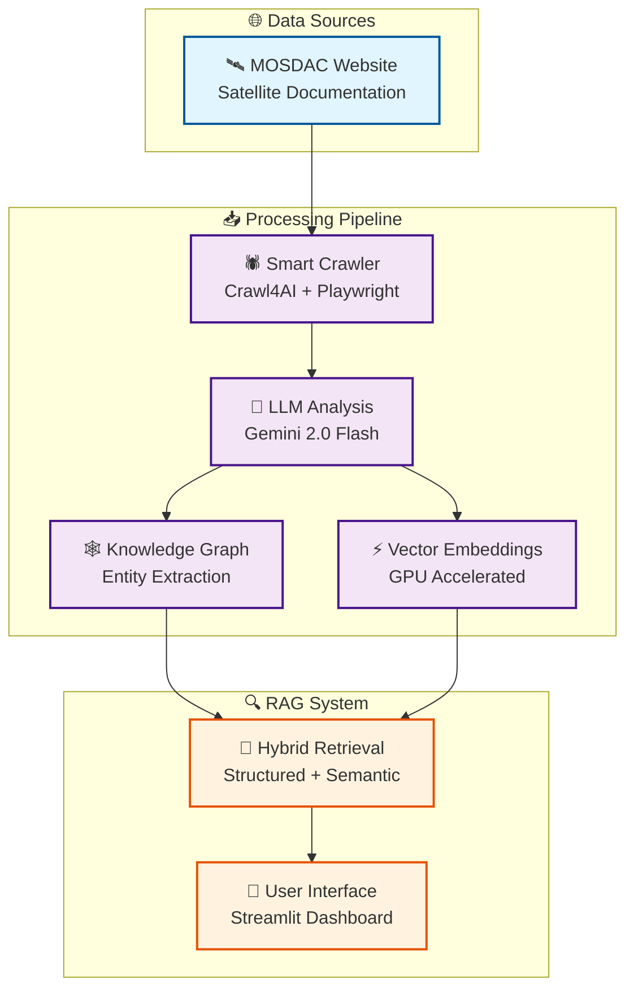

# 🚀 MOSDAC Knowledge-Powered RAG System

<!-- Crawl4AI Attribution Badge -->
<div align="center">
  <a href="https://github.com/unclecode/crawl4ai">
    
  </a>
</div>

> ## 🛰️ **ISRO BAH HACKATHON IDEA SUBMISSION**
>
> **This is an innovative proof-of-concept demonstrating our RAG approach for intelligent satellite data processing.**
>
> 🎯 **Objective**: Novel RAG-based approach for intelligent MOSDAC satellite data processing & querying  
> 🛰️ **Focus Area**: Space Technology & Applications - Data Processing & Knowledge Management  
> 🧪 **Innovation**: LLM-powered knowledge extraction from unstructured space/satellite documentation  
> 📊 **Value**: Transform complex satellite data into intelligent, queryable knowledge systems
>
> ## 🌐 **🚀 LIVE DEMO**
>
> **Try Our System Now**: [spacey-mosdac.streamlit.app](https://spacey-mosdac.streamlit.app/)
>
> _No setup required - Interactive proof-of-concept ready_
>
> ---

## 🌟 **Innovation Statement**

This proof-of-concept addresses a critical challenge in space data management: **making complex satellite and meteorological data more accessible and queryable**. Our system demonstrates how modern RAG technology can transform static MOSDAC documentation into an intelligent knowledge assistant.

**Key Innovation**: Beyond simple document search, our system **understands relationships** between satellites, missions, instruments, and data products, enabling sophisticated queries like _"What instruments on INSAT-3D help with monsoon prediction?"_

> **⚠️ Note**: This is a proof-of-concept demonstration. Production implementation would involve additional complexity including real-time data integration, enterprise security, scalable infrastructure, and extensive domain expertise integration.

## 🌟 **Key Features & Innovation**

- **🎯 Intelligent Content Processing**: Domain-specific web crawling optimized for satellite documentation
- **🧠 LLM-Powered Knowledge Extraction**: Automated extraction of structured knowledge graphs from unstructured content
- **🔍 Dual-Mode RAG Architecture**: Combines structured knowledge graphs with semantic vector search
- **⚡ GPU-Accelerated Processing**: 3-10x speedup for large-scale document processing
- **🎨 Interactive Interface**: Professional dashboard with live pipeline execution and Q&A
- **🎤 Future Voice Interface**: Planned conversational AI for hands-free satellite data queries

## 🏛️ **System Architecture**



**Innovation Points**: Selective crawling, automated knowledge graph generation, GPU optimization, hybrid retrieval combining structured and unstructured search.

## 🚀 **Quick Start**

### 🌐 **Live Demo (Recommended)**

**🚀 Instant Access**: [spacey-mosdac.streamlit.app](https://spacey-mosdac.streamlit.app/)

### 💻 **Local Setup**

```bash
# Clone and setup
git clone https://github.com/garg-tejas/rag-mosdac.git
cd rag-mosdac
pip install -r requirements.txt

# Add your Gemini API key to .env file
cp .env.example .env

# Launch demo
streamlit run streamlit_app.py
```

**Pipeline Commands**:

```bash
python run_pipeline.py --step all    # Full pipeline
python run_pipeline.py --step crawl  # Data acquisition only
python check_gpu.py                  # Verify GPU acceleration
```

## 🛰️ **Space Technology Applications**

**Immediate Value**:

- **Mission Planning**: Quick satellite capability discovery for specific objectives
- **Knowledge Preservation**: Convert documentation into searchable, structured formats
- **Training & Education**: Interactive learning tool for satellite data and missions
- **Cross-Mission Analysis**: Understand relationships between different programs

**Production Scalability**: Multi-agency support, real-time data integration, advanced analytics, multilingual processing.

## 🎯 **Technical Excellence**

**Performance**: GPU acceleration, smart batching, memory optimization, enterprise-grade error handling

**Technology Stack**: Crawl4AI + Playwright (crawling), Gemini 2.0 Flash (LLM), SentenceTransformers (embeddings), ChromaDB (vector search), Streamlit (interface), PyTorch (acceleration)

## 🏆 **Proof-of-Concept Scope**

**What This Demonstrates**:
✅ RAG architecture for satellite data  
✅ Knowledge graph extraction from documentation  
✅ GPU-accelerated processing pipeline  
✅ Interactive query interface  
✅ Professional presentation layer

**Production Considerations**:
🔧 Enterprise security & authentication  
🔧 Real-time satellite data feed integration  
🔧 Scalable cloud infrastructure  
🔧 Domain expert validation systems  
🔧 Regulatory compliance & data governance  
🔧 Multi-user concurrent access  
🔧 Advanced voice interface implementation

---

> **💡 Innovation Summary**: This proof-of-concept demonstrates how modern AI can transform static satellite documentation into intelligent, queryable knowledge systems - showcasing our approach for the future of space data management and mission planning.
